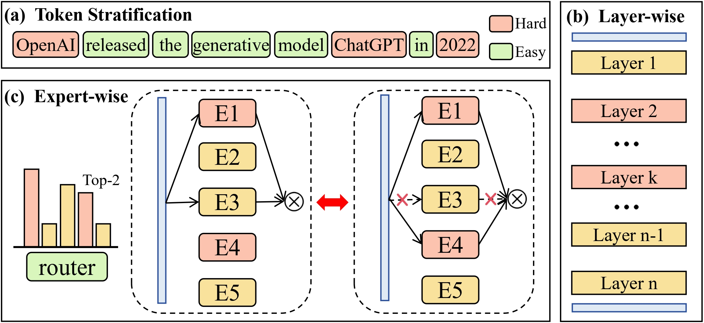
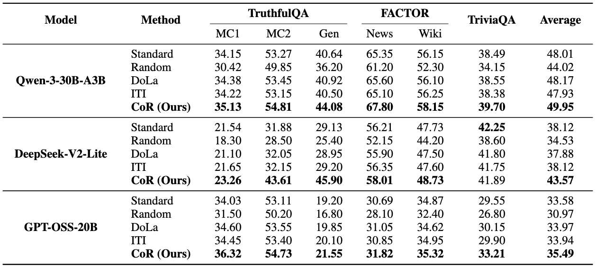

# Awakening Dormant Experts: Counterfactual Routing to Mitigate MoE Hallucinations

Official repository for the ACL 2026 paper:

> Awakening Dormant Experts: Counterfactual Routing to Mitigate MoE Hallucinations

## Overview

Sparse Mixture-of-Experts (MoE) models have achieved remarkable scalability, yet they remain vulnerable to hallucinations, particularly when processing long-tail knowledge. We identify that this fragility stems from static Top-*k* routing: routers tend to favor high-frequency patterns over rare factual associations. Consequently, `specialist experts` possessing critical long-tail knowledge are often assigned low gating scores and remain `dormant`---under-prioritized for specific tokens despite their proven causal importance on other inputs. To address this, we propose Counterfactual Routing (CoR), a training-free inference framework designed to awaken these dormant experts. CoR integrates layer-wise perturbation analysis with the Counterfactual Expert Impact (CEI) metric to dynamically shift computational resources from syntax-dominant to knowledge-intensive layers while maintaining a constant total activation count, effectively retrieving causally decisive experts via virtual ablation. Extensive experiments on TruthfulQA, FACTOR, and TriviaQA demonstrate that CoR improves factual accuracy by 3.1% on average without increasing the inference budget, establishing a superior Pareto frontier compared to static scaling strategies.

_Figure 1. Overview of the Offline Causal Analysis pipeline. The framework consists of three hierarchical stages: (a) Token Stratification: We stratify tokens into hard (knowledge-intensive) and easy (syntax-dominant) subsets based on model uncertainty to disentangle factual reasoning from generic processing. (b) Layer-wise Analysis: We apply Contrastive Sensitivity Normalization to identify knowledge-intensive layers by measuring their relative sensitivity ($R_l$) to hard tokens while mitigating error cascading. (c) Expert-wise Analysis: We compute CEI via virtual ablation to uncover `dormant` experts---causally critical on some tokens but under-prioritized on others._

## Usage

This repository is currently being prepared for public release. Additional materials, including code, configs, and reproduction instructions, will be added incrementally.
- More documentation and implementation details will be added soon.

## Experiments
Table 1. Zero-shot performance of Counterfactual Routing (CoR) compared with baseline methods on factuality benchmarks. CoR is compared with Standard Top-*k* routing, Random routing, and inference-time interventions (DoLa, ITI) across three architectures. Best scores are in bold.

## Citation

Citation information will be added after the final release details are ready.

